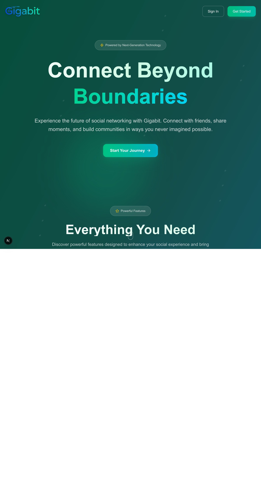
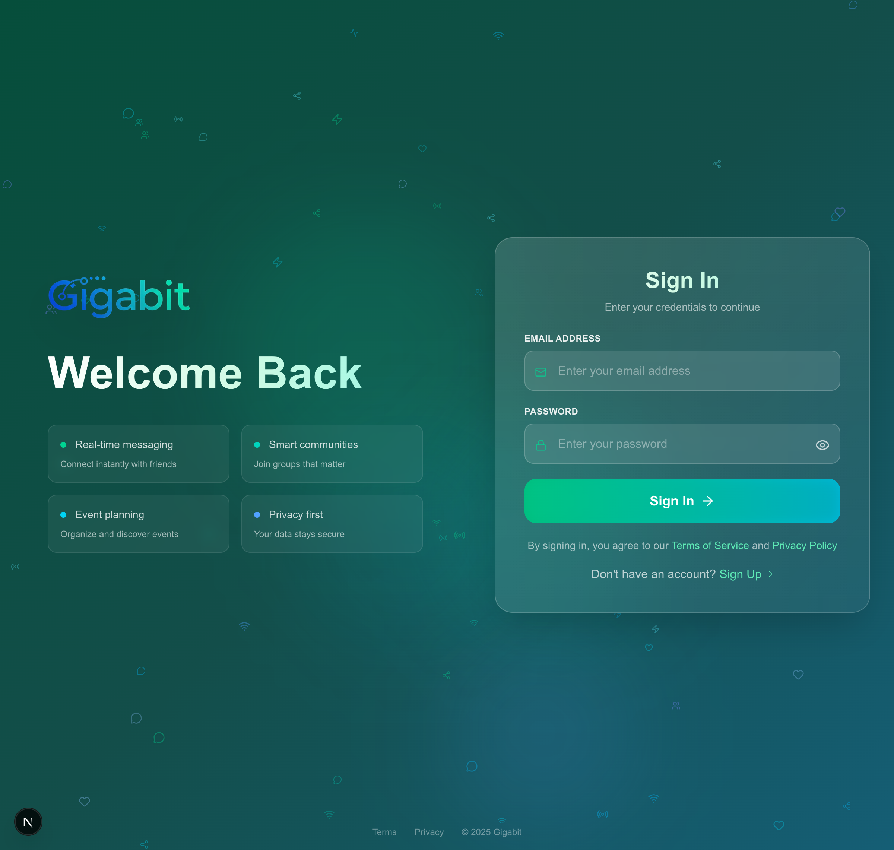
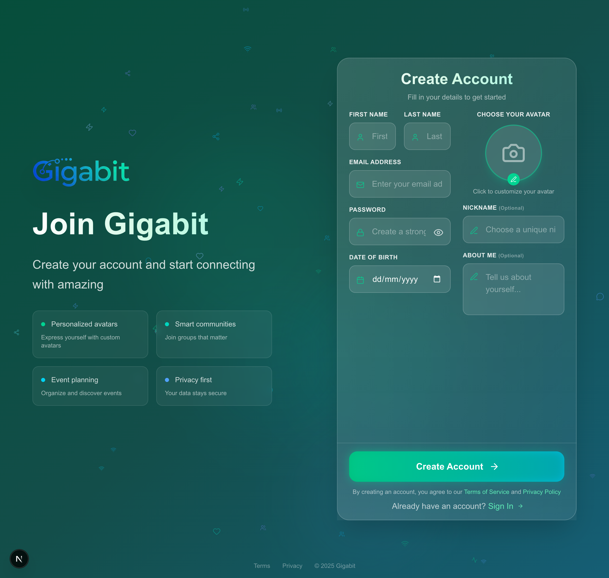
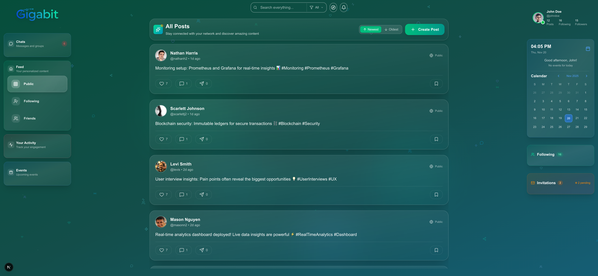
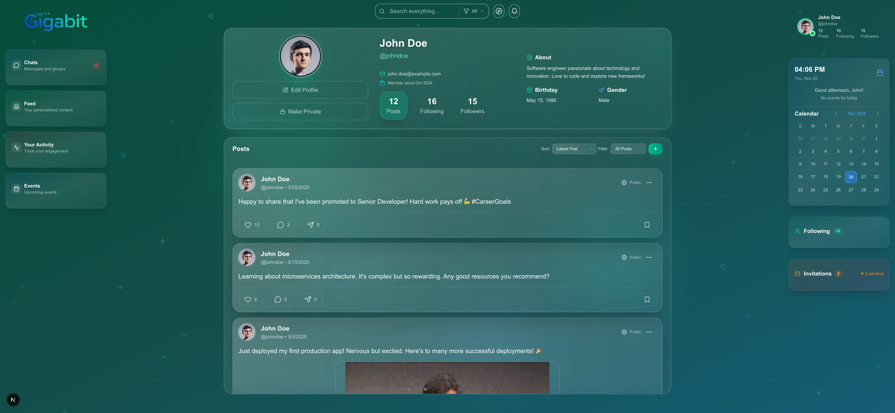
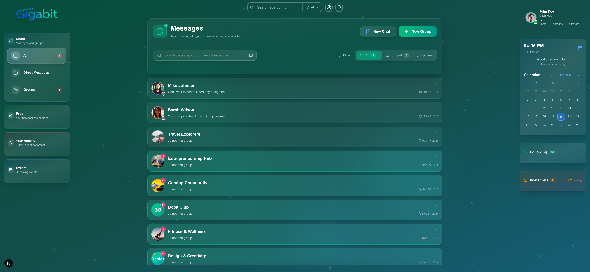
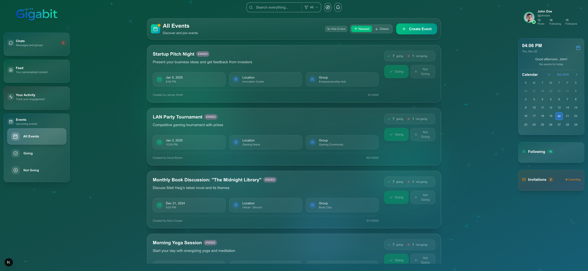

# 🌐 Gigabit Social Network

<div align="center">


**A next-generation social networking platform built for real-time interaction and community building**

[](https://golang.org/)
[](https://nextjs.org/)
[](https://www.typescriptlang.org/)
[](https://www.sqlite.org/)
[](https://www.docker.com/)

[Overview](#-overview) • [Features](#-features) • [Tech Stack](#-tech-stack) • [Screenshots](#-screenshots) • [Architecture](#-architecture) • [Contact](#-contact)

</div>

---

## 🎯 Overview

**Gigabit** is a full-stack social networking platform that combines the power of **Go** for high-performance backend services with **Next.js** for a responsive, modern frontend. Built with scalability and user experience in mind, Gigabit offers everything users expect from a contemporary social platform: real-time messaging, community groups, event management, and granular privacy controls.

### 🌟 Key Highlights

- **⚡ Real-Time Performance**: WebSocket-based architecture for instant updates and live interactions
- **🎨 Modern UX**: Beautiful, responsive interface built with Next.js 15 and Tailwind CSS
- **🔒 Privacy-First**: Granular privacy controls for posts, profiles, and personal information
- **📱 Responsive Design**: Seamless experience across desktop, tablet, and mobile devices
- **🚀 Production-Ready**: Docker support with health checks and monitoring

---

## ✨ Features

### 👥 Social Networking

- **Dynamic Feed**: Personalized content stream with multiple filter options (All, Friends, Following)
- **Follow System**: Follow users, manage friend requests with pending/accepted states
- **User Profiles**: Customizable profiles with avatars, bios, and privacy settings
- **Profile Privacy**: Control who can see your profile and posts
- **Activity Tracking**: View your posts, comments, likes, and bookmarks in one place

### 💬 Real-Time Communication

- **Instant Messaging**: 
  - One-on-one private chats with real-time delivery
  - Group conversations with multiple participants
  - Typing indicators and online status
  - Message read receipts
  - Rich media support (images, emojis)
  
- **Live Updates**: 
  - WebSocket-powered notifications
  - Real-time feed updates
  - Instant message delivery

### 👥 Groups & Communities

- **Group Management**:
  - Create public or private groups
  - Role-based permissions (Admin, Member)
  - Group invitations and join requests
  - Dedicated group feeds and discussions
  
- **Group Features**:
  - Group-specific posts and comments
  - Member management
  - Group conversations
  - Event organization within groups

### 📅 Events

- **Event Creation**: Schedule events with detailed information
- **RSVP System**: Track attendance with Going/Not Going options
- **Event Discovery**: Browse upcoming events from your groups
- **Calendar Integration**: Visual calendar with event markers
- **Notifications**: Get notified about upcoming events

### 📝 Posts & Content

- **Rich Posts**: 
  - Text posts with formatting
  - Image uploads and galleries
  - Polls with multiple options
  - Post privacy controls (Public, Private, Friends Only, Custom)
  
- **Engagement**:
  - Like and bookmark posts
  - Threaded comments
  - Share posts with your network
  - Vote on polls with real-time results

### 🔔 Notifications

- **Real-Time Alerts**: Instant notifications for:
  - New messages
  - Friend requests
  - Post interactions (likes, comments, shares)
  - Group invitations
  - Event updates
  - Poll votes

### 🔍 Search & Discovery

- **Universal Search**: Search across users, groups, and posts
- **Smart Filters**: Refine results by type and relevance
- **User Discovery**: Find and connect with new people

---

## 🛠 Tech Stack

### Backend

| Technology | Purpose | Version |
|------------|---------|---------|
| **Go** | High-performance server | 1.23+ |
| **Gorilla WebSocket** | Real-time bidirectional communication | Latest |
| **SQLite** | Lightweight database | 3.x |
| **golang-migrate** | Database migrations | v4 |
| **bcrypt** | Password hashing | Latest |
| **UUID** | Unique identifiers | v4 |

### Frontend

| Technology | Purpose | Version |
|------------|---------|---------|
| **Next.js** | React framework with App Router | 15.5+ |
| **React** | UI library | 19.1 |
| **TypeScript** | Type-safe development | 5.x |
| **Tailwind CSS** | Utility-first styling | 4.x |
| **Material-UI** | Component library | 7.x |
| **Emotion** | CSS-in-JS styling | 11.x |
| **SWR** | Data fetching and caching | 2.x |
| **Framer Motion** | Animations | Latest |

### DevOps

- **Docker**: Containerization with multi-stage builds
- **Docker Compose**: Multi-container orchestration
- **Health Checks**: Automated service monitoring

---

## 📸 Screenshots

### Authentication


*landing page

*Secure login with JWT authentication*


*User registration with avatar selection*

### Main Application


*Dynamic feed with posts, polls, and real-time updates*


*User profile with posts, followers, and calendar widget*


*Real-time messaging with groups and direct messages*


*Event management and RSVP system*

---

## 🏗 Architecture

### System Architecture

```
┌─────────────────┐         ┌─────────────────┐         ┌─────────────────┐
│                 │         │                 │         │                 │
│  Next.js        │◄────────┤  Go Backend     │◄────────┤  SQLite         │
│  Frontend       │         │  (REST + WS)    │         │  Database       │
│                 │         │                 │         │                 │
└─────────────────┘         └─────────────────┘         └─────────────────┘
        │                           │
        │                           │
        ├───── HTTP/HTTPS ──────────┤
        │                           │
        └───── WebSocket ───────────┘
```

### Backend Structure

```
Backend/
├── handlers/           # HTTP request handlers
│   ├── auth.go        # Authentication & sessions
│   ├── post.go        # Post management
│   ├── chat_handler.go# Chat endpoints
│   ├── group.go       # Group management
│   ├── event.go       # Event handling
│   └── ...
├── services/          # Business logic layer
│   ├── post_service.go
│   ├── chat_service.go
│   ├── group_service.go
│   └── ...
├── models/            # Data structures
│   ├── user.go
│   ├── post.go
│   ├── message.go
│   └── ...
├── websocket/         # Real-time communication
│   ├── hub.go         # WebSocket hub
│   ├── client.go      # Client connections
│   ├── handlers.go    # Message handlers
│   └── types.go       # Message types
├── middleware/        # HTTP middleware
│   ├── auth.go        # JWT validation
│   └── error.go       # Error handling
├── pkg/db/            # Database layer
│   ├── migrations/    # SQL migrations
│   └── sqlite/        # SQLite utilities
└── mockdata/          # Sample data for testing
```

### Frontend Structure

```
Frontend/
├── app/               # Next.js App Router
│   ├── feed/         # Feed pages
│   ├── chats/        # Chat interface
│   ├── profile/      # User profiles
│   ├── events/       # Event pages
│   └── ...
├── components/        # React components
│   ├── chat/         # Chat components
│   ├── posts/        # Post components
│   ├── groups/       # Group components
│   ├── events/       # Event components
│   ├── layout/       # Layout components
│   └── ui/           # Reusable UI components
├── context/           # React Context providers
│   ├── AuthContext.tsx
│   ├── WebSocketContext.tsx
│   └── ToastContext.tsx
├── hooks/             # Custom React hooks
│   ├── useAuth.ts
│   ├── useWebSocket.ts
│   ├── usePosts.ts
│   └── ...
├── lib/               # Utilities and API clients
│   ├── api/          # API service layer
│   └── api.ts        # Base API client
└── types/             # TypeScript type definitions
```

### Key Design Patterns

- **RESTful API**: Standard HTTP endpoints for CRUD operations
- **WebSocket Hub**: Central hub for managing real-time connections
- **Service Layer**: Business logic separated from HTTP handlers
- **Repository Pattern**: Database operations abstracted in services
- **JWT Authentication**: Stateless authentication with secure tokens
- **Context API**: Global state management in React
- **Custom Hooks**: Reusable logic for data fetching and state

---

## 🔌 API Endpoints

### Authentication

| Endpoint | Method | Description |
|----------|--------|-------------|
| `/api/register` | POST | Create a new user account |
| `/api/login` | POST | Authenticate and receive JWT token |
| `/api/logout` | POST | Invalidate session |

### Posts

| Endpoint | Method | Description |
|----------|--------|-------------|
| `/api/posts` | GET | Fetch posts (feed) |
| `/api/posts` | POST | Create a new post |
| `/api/posts/{id}` | GET | Get specific post |
| `/api/posts/{id}/like` | POST | Like/unlike a post |
| `/api/posts/{id}/comment` | POST | Comment on a post |
| `/api/posts/{id}/bookmark` | POST | Bookmark a post |
| `/api/posts/{id}/share` | POST | Share a post |

### Groups

| Endpoint | Method | Description |
|----------|--------|-------------|
| `/api/groups` | GET | List all groups |
| `/api/groups` | POST | Create a new group |
| `/api/groups/{id}` | GET | Get group details |
| `/api/groups/{id}/join` | POST | Join a group |
| `/api/groups/{id}/leave` | POST | Leave a group |
| `/api/groups/{id}/posts` | GET | Get group posts |

### Messages

| Endpoint | Method | Description |
|----------|--------|-------------|
| `/api/conversations` | GET | List conversations |
| `/api/conversations/{id}/messages` | GET | Get messages |
| `/api/messages` | POST | Send a message |

### Events

| Endpoint | Method | Description |
|----------|--------|-------------|
| `/api/events` | GET | List events |
| `/api/events` | POST | Create an event |
| `/api/events/{id}` | GET | Get event details |
| `/api/events/{id}/rsvp` | POST | RSVP to event |

### WebSocket

Connect to `/ws` for real-time updates:
- Message notifications
- Post updates
- Online status
- Typing indicators

---

## 🔐 Security Features

- **Password Hashing**: bcrypt with salt for secure password storage
- **JWT Tokens**: Secure, stateless authentication
- **CORS Protection**: Configured for production environments
- **SQL Injection Prevention**: Prepared statements throughout
- **XSS Protection**: Input sanitization and validation
- **Privacy Controls**: Granular permissions for posts and profiles
- **Session Management**: Secure token handling and refresh

---

## 🎨 UI/UX Highlights

- **Responsive Design**: Mobile-first approach with breakpoints for all devices
- **Dark Theme**: Eye-friendly color scheme throughout the application
- **Smooth Animations**: Framer Motion for delightful interactions
- **Accessibility**: ARIA labels and keyboard navigation support
- **Loading States**: Skeleton loaders and spinners for better UX
- **Error Handling**: User-friendly error messages and retry mechanisms
- **Toast Notifications**: Non-intrusive feedback for user actions
- **Optimistic Updates**: Instant UI feedback for user interactions

---

## 📦 Database Schema

The application uses SQLite with 50+ migration files covering:

- **Users**: Profiles, authentication, privacy settings
- **Posts**: Content, privacy, likes, bookmarks, shares
- **Comments**: Threaded discussions with nested replies
- **Messages**: Private and group conversations
- **Groups**: Communities with memberships and roles
- **Events**: Event details, RSVPs, and attendees
- **Polls**: Poll options and vote tracking
- **Notifications**: Activity tracking and alerts
- **Sessions**: JWT session management
- **Follows**: User relationships and friend requests

---

## 💼 Technical Skills Demonstrated

This project showcases proficiency in:

✅ **Backend Development**
- Go programming with modern best practices
- RESTful API design and implementation
- WebSocket real-time communication
- Database design and SQL migrations
- Authentication and authorization
- Middleware and error handling

✅ **Frontend Development**
- React with TypeScript
- Next.js 15 App Router
- Responsive UI design
- State management with Context API
- Custom hooks for reusable logic
- Real-time UI updates

✅ **DevOps & Tools**
- Docker containerization
- Multi-stage builds for optimization
- Docker Compose orchestration
- Health checks and monitoring
- Git version control

✅ **Software Engineering**
- Clean architecture patterns
- Service layer separation
- Code organization and modularity
- API documentation
- Security best practices

---

## 📞 Contact

> **Interested in seeing a live demo or running this project?**
> 
> Please feel free to reach out to me directly. I'd be happy to provide a demonstration, discuss the technical implementation, or walk you through the codebase.


**Contact Information:**
- **Email**: qassimhassan9@gmail.com
- **LinkedIn**: [LinkedIn](https://www.linkedin.com/in/qassim-aljaffer)  


I'm available for:
- 🚀 Live demo sessions
- 💼 Technical interviews
- 🤝 Collaboration opportunities
- 📧 Code access requests

---

## 📝 License

This project is proprietary and confidential. All rights reserved.

---

<div align="center">

**⭐ Interested in this project? Let's connect!**

*Built with Go, Next.js, TypeScript, and a passion for clean code*

</div>
